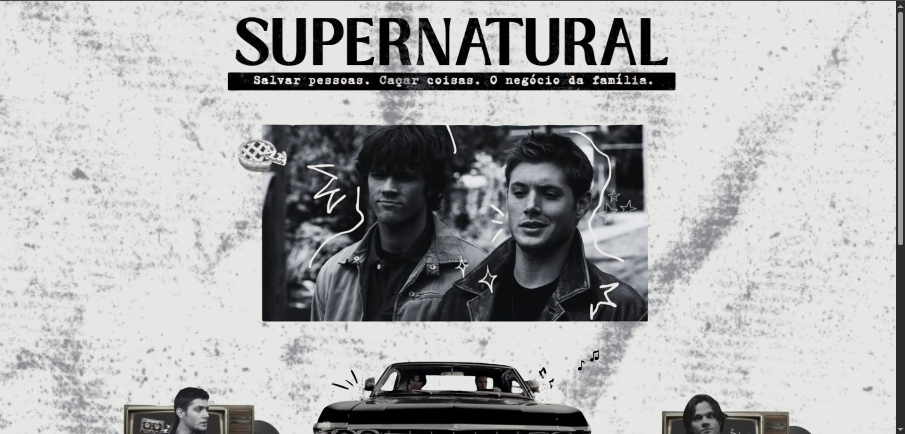
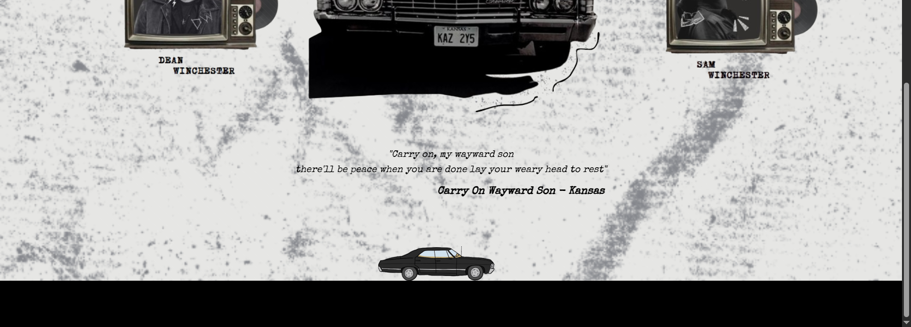

# ⛦ Supernatural ⛦

<i> Este projeto foi desenvolvido utilizando HTML, CSS e JavaScript, com o objetivo de aprofundar meus estudos em desenvolvimento web e praticar a aplicação dessas linguagens na construção de interfaces.

## Desenvolvimento 𓆩𓆪

## Links ٠࣪⭑

[Site](https://supernatural.onrender.com/)  
[Protótipo](https://www.canva.com/design/DAGva2h92rY/DuxS-n1Rz2pDB4uLjklPjQ/edit)
